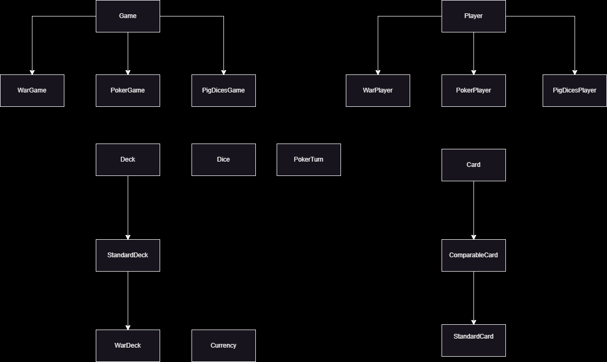

# **Board Games**

Welcome to the Board Games project! The goal of this project is to provide modules that can be used to create various board games. Each module is designed to be reusable and easy to extend, allowing for the creation of complex game mechanics with ease.

# Table of Contents
- [Created Games](#created-games)
- [Current Modules](#current-modules)
- [UML Diagram](#uml-diagram)
- [Repository Structure](#repository-structure)
- [Requirements](#requirements)
- [Repository Initialization](#repository-initialization)
- [Modules](#modules)
- [Games](#games)
  - [PigDices](#pigdices)
    - [Modules used by PigDices](#modules-used-by-pigdices)
    - [Module Descriptions](#module-descriptions)
  - [War](#war)
    - [Modules used by War](#modules-used-by-war)
    - [Module Descriptions](#module-descriptions)
  - [Poker](#poker)
    - [Modules used by Poker](#modules-used-by-poker)
    - [Module Descriptions](#module-descriptions)
- [Contribution](#contribution)
    - [Tomasz Okoń](#tomasz-okoń)
    - [Łukasz Szydlik](#łukasz-szydlik)
    - [Dominik Śledziewski](#dominik-śledziewski)

# Created Games

- **PigDices**: A dice game where players roll dice to accumulate points.
- **War**: A card game where players compete to capture all the cards.
- **Poker**: A classic card game based on betting and strategy.

# Current Modules
- **Card**: Base class for all types of cards.
- **ComparableCard**: Extension of the Card class that allows for card comparison.
- **StandardCard**: A standard playing card with ranks and suits.
- **Currency**: Module for handling in-game currency.
- **Deck**: Base class for card decks.
- **StandardDeck**: A standard 52-card deck.
- **Dice**: Module for handling dice rolls.
- **Game**: Base class for all games.
- **Player**: Base class for all players.

# UML Diagram
The UML diagram, presented in the file `Structure.png`, illustrates the class structure in the Board Games project.


# Repository Structure

The Board Games project repository is divided into several main directories, making it easy to organize code, tests, and executable files. Below is the description of the directory structure:

- **executables/Debug**: 
  - Contains `.exe` files for games and tests.
  - Structure:
    ```
    executables/Debug/
    ├── basetests.exe
    ├── pig_dices_tests.exe
    ├── Pig_Dices.exe
    ├── Poker.exe
    ├── War.exe
    ├── wartests.exe
    ```

- **tests/**:
  - Contains tests for the respective modules.
  - Structure:
    ```
    tests/
    ├── BaseGameTests/
    ├── PigDicesTests/
    ├── WarTests/
    └── PokerTests/
    ```

- **src/**:
  - Contains folders with source code.
  - Structure:
    ```
    src/
    ├── BaseGame/
    ├── PigDices/
    ├── War/
    ├── Poker/
    ├── PigDices_interface/
    ├── War_interface/
    └── Poker_interface/
    ```

Each directory contains the appropriate source, header, and test files, ensuring clarity and ease of navigation within the project.

# Requirements
- CMake 3.14 or later
- C++ compiler supporting C++20
- Git

# Repository Initialization
1. Clone the repository to your chosen folder.
1. Create a "build" directory inside the repository.
1. Using the command line (terminal, PowerShell...) navigate to the build directory with the command `cd ./build`.
1. Enter `cmake ..`
1. Enter `cmake --build .`
1. If there is an error, repeat the last 2 steps.
1. After compilation, the program should be located in `{repo}/executables` or `{repo}/executables/Debug`.
1. To run the program, navigate to the directory where the program is located and enter `./{SelectedGame/Test}.exe` in the terminal or run the `{SelectedGame/Test}.exe` file from the graphical interface.

# Modules

### Card
The `Card` class is a base class representing a generic card. It contains basic properties such as the card name.

### ComparableCard
The `ComparableCard` class extends `Card` and allows for comparing cards based on defined criteria.

### StandardCard
The `StandardCard` class represents a single standard playing card, inheriting from `ComparableCard`.

### Currency
The `Currency` class is used to handle the value of currency in the game. It allows setting, getting, adding, and updating the currency value.

### Deck
The `Deck` class is a virtual base class containing a vector of pointers to objects derived from `Card`. It includes methods for randomly drawing cards and resetting the deck.

### StandardDeck
The `StandardDeck` class represents a standard 52-card deck, inheriting from `Deck`. It includes a method for resetting the deck, creating a standard set of cards.

### Dice
The `Dice` class handles dice rolls with a specified number of sides.

### Game
The `Game` class is a base class for all games, containing common methods and properties such as adding players, starting the game, managing turns, and checking win conditions.

### Player
The `Player` class is a base class for all players, containing common properties and methods such as storing the player's name.

# Games

## PigDices
The `PigDicesGame` class represents a dice game where players take turns rolling dice to accumulate points. The first player to reach a set number of points wins.

### Modules used by PigDices:
- **PigDicesGame**: Inherits from `Game<PigDicesPlayer>`, implements specific rules for the dice game, such as turns, dice rolls, point management, and player decisions.
- **PigDicesPlayer**: Inherits from `Player` and adds properties related to player scoring.
- **Currency**: Used for storing and manipulating player points.
- **Dice**: Used for generating dice rolls.

### Module Descriptions:

#### **PigDicesGame**
The `PigDicesGame` class inherits from `Game` and implements specific rules for the dice game.
- Inherits from: `Game<PigDicesPlayer>`
- Uses modules: `PigDicesPlayer`, `Dice`, `Currency`

#### **PigDicesPlayer**
The `PigDicesPlayer` class inherits from `Player` and adds properties and methods for storing and manipulating player points.
- Inherits from: `Player`
- Additional properties: `_score` (an object of class `Currency`)

## War
The `WarGame` class represents a card game where players compete to capture all the cards. The game ends when one player captures all the cards.

### Modules used by War:
- **WarGame**: Inherits from `Game<WarPlayer>`, implements specific rules for the card game, such as turn-taking, card management, and victory conditions.
- **WarPlayer**: Inherits from `Player` and adds properties related to player cards.
- **WarDeck**: Inherits from `StandardDeck` and adds methods for shuffling and dealing cards.
- **StandardCard**: Used to represent cards in the deck.

### Module Descriptions:

#### **WarGame**
The `WarGame` class inherits from `Game` and implements specific rules for the card game.
- Inherits from: `Game<WarPlayer>`
- Uses modules: `WarPlayer`, `WarDeck`, `StandardCard`

#### **WarPlayer**
The `WarPlayer` class inherits from `Player` and adds properties and methods for storing and manipulating player cards.
- Inherits from: `Player`
- Additional properties: `_cards` (a vector of pointers to `StandardCard` objects)

#### **WarDeck**
The `WarDeck` class inherits from `StandardDeck` and implements methods for shuffling and dealing cards.
- Inherits from: `StandardDeck`
- Additional methods: `deal_cards` (deals cards between two players)

## Poker
The `PokerGame` class represents a classic card game based on betting and strategy. The game ends when one player wins all the chips.

### Modules used by Poker:
- **PokerGame**: Implements specific rules for the poker game, such as turn-taking, bet management, and victory conditions.
- **PokerPlayer**: Adds properties related to player chips and cards.
- **PokerTurn**: Implements the logic of each poker turn.
- **StandardDeck**: Used for shuffling and dealing cards.
- **StandardCard**: Used to represent cards in the deck.
- **Currency**: Used for handling bet values.

### Module Descriptions:

#### **PokerGame**
The `PokerGame` class implements specific rules for the poker game.
- Uses modules: `PokerPlayer`, `PokerTurn`, `StandardDeck`, `StandardCard`, `Currency`

#### **PokerPlayer**
The `PokerPlayer` class adds properties and methods for storing and manipulating player chips and cards.
- Additional properties: `_balance` (an object of class `Currency`), `_cards` (a pair of pointers to `StandardCard` objects)

#### **PokerTurn**
The `PokerTurn` class implements the logic of each poker turn, including bet management and player interactions.
- Uses modules: `StandardCard`, `Currency`

# **Contribution**
Who was responsible for what:
## Tomasz Okoń https://github.com/Kemo321
- CMake scripts
### Implementation of:
- Card
- Dice
- War
### Tests for:
- War
- Poker
## Łukasz Szydlik https://github.com/WARDROK
- Documentation
- Docstrings
### Implementation of:
- Game
- Player
- ComparableCard
- Pig Dices
### Tests for:
- Pig Dices
- Base Game
## Dominik Śledziewski https://github.com/Alveaenerle
- UML diagram
### Implementation of:
- Currency
- StandardCard
- StandardDeck
- Poker
