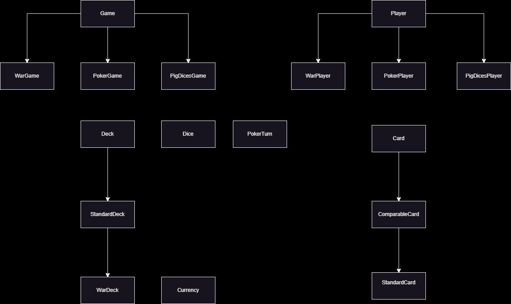

# **Gry Planszowe**

Witamy w projekcie Gry Planszowe! Celem tego projektu jest dostarczenie modułów, które mogą być używane do tworzenia różnorodnych gier planszowych. Każdy moduł jest zaprojektowany tak, aby był wielokrotnego użytku i łatwy do rozszerzenia, co pozwala na tworzenie złożonych mechanik gier z łatwością.

# Spis Treści
- [Stworzone Gry](#stworzone-gry)
- [Aktualne Moduły](#aktualne-moduły)
- [Diagram UML](#diagram-uml)
- [Podział Repozytorium na Katalogi](#podział-repozytorium-na-katalogi)
- [Wymagania](#wymagania)
- [Inicjalizacja Repozytorium](#inicjalizacja-repozytorium)
- [Moduły](#moduły)
- [Gry](#gry)
  - [PigDices](#pigdices)
    - [Moduły używane przez PigDices](#moduły-używane-przez-pigdices)
    - [Opis modułów](#opis-modułów)
  - [War](#war)
    - [Moduły używane przez War](#moduły-używane-przez-war)
    - [Opis modułów](#opis-modułów)
  - [Poker](#poker)
    - [Moduły używane przez Poker](#moduły-używane-przez-poker)
    - [Opis modułów](#opis-modułów)
- [Wkład](#wkład)
    - [Tomasz Okoń](#tomasz-okoń)
    - [Łukasz Szydlik](#łukasz-szydlik)
    - [Dominik Śledziewski](#dominik-śledziewski)

# Stworzone Gry

- **PigDices**: Gra w kości, w której gracze rzucają kośćmi, aby gromadzić punkty.
- **War**: Gra karciana, w której gracze rywalizują, aby zdobyć wszystkie karty.
- **Poker**: Klasyczna gra karciana oparta na zakładach i strategii.

# Aktualne Moduły
- **Card**: Klasa bazowa dla wszystkich typów kart.
- **ComparableCard**: Rozszerzenie klasy Card, które pozwala na porównywanie kart.
- **StandardCard**: Standardowa karta do gry z rangami i kolorami.
- **Currency**: Moduł do obsługi waluty w grze.
- **Deck**: Klasa bazowa dla talii kart.
- **StandardDeck**: Standardowa talia 52 kart.
- **Dice**: Moduł kości do obsługi rzutów kośćmi.
- **Game**: Klasa bazowa dla wszystkich gier.
- **Player**: Klasa bazowa dla wszystkich graczy.

# Diagram UML
Diagram UML, przedstawiony w pliku `Structure.png`, ilustruje strukturę klas w projekcie Gry Planszowe.


# Podział Repozytorium na Katalogi

Repozytorium projektu Gry Planszowe jest podzielone na kilka głównych katalogów, co ułatwia organizację kodu, testów oraz plików wykonywalnych. Poniżej znajduje się opis struktury katalogów:

- **executables/Debug**: 
  - Zawiera pliki `.exe` gier i testów.
  - Struktura:
    ```
    executables/Debug/
    ├── basetests.exe
    ├── pig_dices_tests.exe
    ├── Pig_Dices.exe
    ├── Poker.exe
    ├── War.exe
    ├── wartests.exe
    ```

- **tests/**:
  - Zawiera testy do odpowiednich modułów.
  - Struktura:
    ```
    tests/
    ├── BaseGameTests/
    ├── PigDicesTests/
    ├── WarTests/
    └── PokerTests/
    ```

- **src/**:
  - Zawiera foldery z kodem źródłowym.
  - Struktura:
    ```
    src/
    ├── BaseGame/
    ├── PigDices/
    ├── War/
    ├── Poker/
    ├── PigDices_interface/
    ├── War_interface/
    └── Poker_interface/
    ```

Każdy katalog zawiera odpowiednie pliki źródłowe, nagłówkowe oraz testy, co zapewnia przejrzystość i łatwość w nawigacji po projekcie.

# Wymagania
-   CMake 3.14 lub nowszy
-   Kompilator C++ wspierający C++20
-   Git

# Inicjalizacja Repozytorium
1. Sklonuj repozytorium w wybranym folderze.
1. Utwórz katalog „build” wewnątrz repozytorium.
1. Korzystając z wiersza poleceń (terminal, PowerShell...) przejdź do katalogu kompilacji za pomocą polecenia `cd ./build`.
1. Wpisz `cmake ..`
1. Wpisz `cmake --build .`
1. W razie błędu wykonaj ponownie kolejno 2 ostatnie kroki
1. Po kompilacji program powinien znajdować się w `{repo}/executables` lub `{repo}/executables/Debug`.
1. Aby uruchomić program, przejdź do katalogu, w którym znajduje się program i wpisz w terminalu `./{WybranaGra/Test}.exe` lub uruchom plik `{WybranaGra/Test}.exe` z poziomu interfejsu graficznego.

# Moduły

### Card
Klasa `Card` jest klasą bazową reprezentującą ogólną kartę. Zawiera podstawowe właściwości, takie jak nazwa karty.

### ComparableCard
Klasa `ComparableCard` rozszerza `Card` i umożliwia porównywanie kart na podstawie zdefiniowanych kryteriów.

### StandardCard
Klasa `StandardCard` reprezentuje pojedynczą standardową kartę do gry, która dziedziczy po `ComparableCard`.

### Currency
Klasa `Currency` służy do obsługi wartości waluty w grze. Umożliwia ustawianie, pobieranie, dodawanie oraz aktualizowanie wartości waluty.

### Deck
Klasa `Deck` jest wirtualną klasą bazową zawierającą wektor wskaźników do obiektów pochodzących od `Card`. Zawiera metody do losowego dobierania kart oraz resetowania talii.

### StandardDeck
Klasa `StandardDeck` reprezentuje standardową talię 52 kart, która dziedziczy po `Deck`. Zawiera metodę do resetowania talii, tworząc standardowy zestaw kart.

### Dice
Klasa `Dice` obsługuje rzuty kośćmi o określonej liczbie ścianek.

### Game
Klasa `Game` jest klasą bazową dla wszystkich gier, zawierającą wspólne metody i właściwości, takie jak dodawanie graczy, rozpoczęcie gry, zarządzanie turami i sprawdzanie warunków zwycięstwa.

### Player
Klasa `Player` jest klasą bazową dla wszystkich graczy, zawierającą wspólne właściwości i metody, takie jak przechowywanie imienia gracza.

# Gry

## PigDices
Klasa `PigDicesGame` reprezentuje grę w kości, w której gracze na zmianę rzucają kośćmi, aby gromadzić punkty. Pierwszy gracz, który osiągnie ustaloną liczbę punktów, wygrywa.

### Moduły używane przez PigDices:
- **PigDicesGame**: Dziedziczy po `Game<PigDicesPlayer>`, implementuje specyficzne zasady gry w kości, takie jak tury, rzuty kośćmi, zarządzanie punktami oraz decyzje gracza.
- **PigDicesPlayer**: Dziedziczy po `Player` i dodaje właściwości związane z punktacją gracza.
- **Currency**: Używany do przechowywania i manipulowania punktami graczy.
- **Dice**: Używany do generowania rzutów kośćmi.

### Opis modułów:

#### **PigDicesGame**
Klasa `PigDicesGame` dziedziczy po `Game` i implementuje specyficzne zasady gry w kości.
- Dziedziczy po: `Game<PigDicesPlayer>`
- Używa modułów: `PigDicesPlayer`, `Dice`, `Currency`

#### **PigDicesPlayer**
Klasa `PigDicesPlayer` dziedziczy po `Player` i dodaje właściwości oraz metody do przechowywania i manipulowania punktami gracza.
- Dziedziczy po: `Player`
- Dodatkowe właściwości: `_score` (obiekt klasy `Currency`)

## War
Klasa `WarGame` reprezentuje grę karcianą, w której gracze rywalizują, aby zdobyć wszystkie karty. Gra kończy się, gdy jeden z graczy zdobędzie wszystkie karty.

### Moduły używane przez War:
- **WarGame**: Dziedziczy po `Game<WarPlayer>`, implementuje specyficzne zasady gry karcianej, takie jak rozgrywanie tur, zarządzanie kartami oraz sprawdzanie zwycięstwa.
- **WarPlayer**: Dziedziczy po `Player` i dodaje właściwości związane z kartami gracza.
- **WarDeck**: Dziedziczy po `StandardDeck` i dodaje metody związane z tasowaniem i rozdawaniem kart.
- **StandardCard**: Używany do reprezentowania kart w talii.

### Opis modułów:

#### **WarGame**
Klasa `WarGame` dziedziczy po `Game` i implementuje specyficzne zasady gry karcianej.
- Dziedziczy po: `Game<WarPlayer>`
- Używa modułów: `WarPlayer`, `WarDeck`, `StandardCard`

#### **WarPlayer**
Klasa `WarPlayer` dziedziczy po `Player` i dodaje właściwości oraz metody do przechowywania i manipulowania kartami gracza.
- Dziedziczy po: `Player`
- Dodatkowe właściwości: `_cards` (wektor wskaźników do obiektów klasy `StandardCard`)

#### **WarDeck**
Klasa `WarDeck` dziedziczy po `StandardDeck` i implementuje metody związane z tasowaniem i rozdawaniem kart.
- Dziedziczy po: `StandardDeck`
- Dodatkowe metody: `deal_cards` (rozdziela karty między dwóch graczy)

## Poker
Klasa `PokerGame` reprezentuje klasyczną grę karcianą opartą na zakładach i strategii. Gra kończy się, gdy jeden z graczy wygrywa wszystkie żetony.

### Moduły używane przez Poker:
- **PokerGame**: Implementuje specyficzne zasady gry pokerowej, takie jak rozgrywanie tur, zarządzanie zakładami oraz sprawdzanie zwycięstwa.
- **PokerPlayer**: Dodaje właściwości związane z żetonami i kartami gracza.
- **PokerTurn**: Implementuje logikę każdej tury pokerowej.
- **StandardDeck**: Używany do tasowania i rozdawania kart.
- **StandardCard**: Używany do reprezentowania kart w talii.
- **Currency**: Używany do obsługi wartości zakładów.

### Opis modułów:

#### **PokerGame**
Klasa `PokerGame` implementuje specyficzne zasady gry pokerowej.
- Używa modułów: `PokerPlayer`, `PokerTurn`, `StandardDeck`, `StandardCard`, `Currency`

#### **PokerPlayer**
Klasa `PokerPlayer` dodaje właściwości oraz metody do przechowywania i manipulowania żetonami oraz kartami gracza.
- Dodatkowe właściwości: `_balance` (obiekt klasy `Currency`), `_cards` (para wskaźników do obiektów klasy `StandardCard`)

#### **PokerTurn**
Klasa `PokerTurn` implementuje logikę każdej tury pokerowej, w tym zarządzanie zakładami i interakcjami graczy.
- Używa modułów: `StandardCard`, `Currency`

# **Wkład**
Kto za co był odpowiedzialny
## Tomasz Okoń https://github.com/Kemo321
- Skrypty CMake
### Implementacja:
- Card
- Dice
- War
### Testy dla:
- War
- Poker
## Łukasz Szydlik https://github.com/WARDROK
- Dokumntacja
- Docstrings
### Implementacja:
- Game
- Player
- ComparableCard
- Pig Dices
### Testy dla:
- Pig Dices
- Base Game
## Dominik Śledziewski https://github.com/Alveaenerle
- UML diagram
### Implementacja:
- Currency
- StandardCard
- StandardDeck
- Poker
